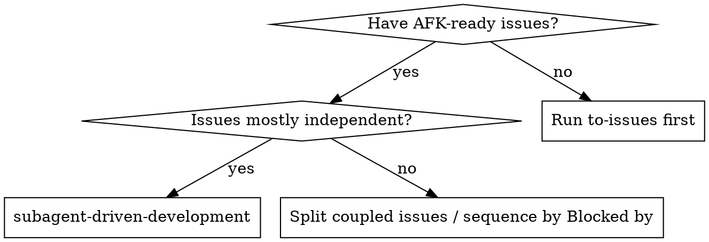
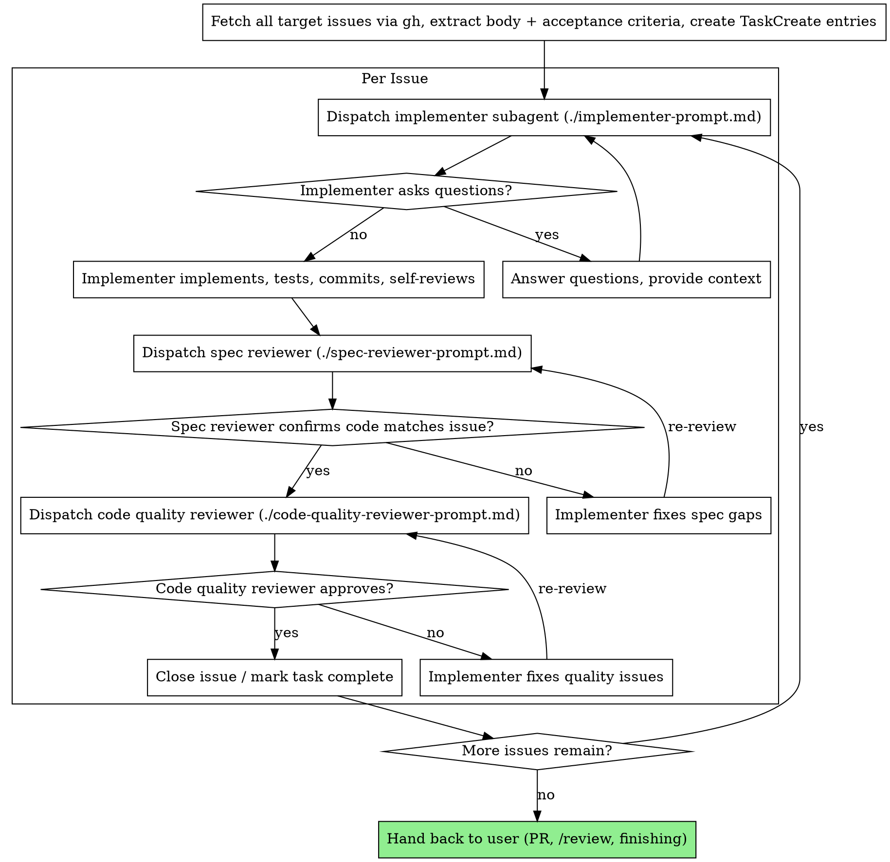

# Subagent-Driven Development

Execute issues by dispatching a fresh subagent per issue, with two-stage review after each: spec compliance review first, then code quality review.

**Why subagents:** You delegate tasks to specialized agents with isolated context. By precisely crafting their instructions and context, you ensure they stay focused and succeed at their task. They should never inherit your session's context or history — you construct exactly what they need. This also preserves your own context for coordination work.

**Core principle:** Fresh subagent per issue + two-stage review (spec then quality) = high quality, fast iteration.

**Continuous execution:** Do not pause to check in with the user between issues. Execute all issues in the batch without stopping. The only reasons to stop are: BLOCKED status you cannot resolve, ambiguity that genuinely prevents progress, or all issues complete. "Should I continue?" prompts and progress summaries waste their time — they asked you to execute the batch, so execute it.

## Inputs

This skill consumes issues from the project issue tracker (`gh issue ...`). The natural producers are:

- [[grill-with-docs]] → [[to-prd]] → [[to-issues]] — turns a brainstorm into AFK-ready issues labelled `ready-for-agent` (or your project's equivalent).
- Manually authored issues that meet the same bar: clear acceptance criteria, vertical-slice scope, no open architectural questions.

Before starting, confirm with the user:

1. **Which issues**: a list of issue numbers, or a label filter (e.g. `gh issue list -l ready-for-agent`).
2. **Where to work**: typically a feature branch in a git worktree — use the `EnterWorktree` tool to isolate from the user's working copy unless they say otherwise.
3. **TDD or not**: defaults to following the [[tdd]] skill where it fits (any new behavior). Skip only when the user explicitly says so.

## When to Use



## The Process



### Step 0: Extract issues upfront

Read **every** target issue once via `gh issue view <number>` and capture:

- Issue number + title
- Full body (What to build, Acceptance criteria, Blocked by)
- Any comments that add scope or constraints
- Files/areas it touches (from your own quick read)

Create one `TaskCreate` task per issue with the full text in the description, so you don't have to re-read the issue tracker mid-flight. Set `addBlockedBy` to model the "Blocked by" relationships from the issues themselves.

**Why upfront:** the controller (you) is the only place that knows the full picture. Subagents should never read the issue tracker — you paste the full text into their prompt.

## Model Selection

Default every dispatch to Opus (`model: "opus"`). SDD's value proposition is shipping reliably while AFK — work quality and review quality matter more than per-task cost.

When dispatching, always pass `model: "opus"` in the `Agent` call:

- Implementer → `Agent(subagent_type: general-purpose, model: "opus", ...)`
- Spec reviewer → same
- Code-quality reviewer → same

Without an explicit `model:`, the `general-purpose` agent type defaults to Sonnet, which is a downgrade for SDD purposes.

Downgrade to `model: "sonnet"` only when the implementer task is genuinely mechanical (1–2 files, complete spec, no judgment) and saving tokens is the explicit goal. Reviewers should always run on Opus — they're the quality gate.

## Handling Implementer Status

Implementer subagents report one of four statuses. Handle each appropriately:

**DONE:** Proceed to spec compliance review.

**DONE_WITH_CONCERNS:** The implementer completed the work but flagged doubts. Read the concerns before proceeding. If the concerns are about correctness or scope, address them before review. If they're observations (e.g. "this file is getting large"), note them and proceed to review.

**NEEDS_CONTEXT:** The implementer needs information that wasn't provided. Provide the missing context and re-dispatch.

**BLOCKED:** The implementer cannot complete the issue. Assess the blocker:

1. If it's a context problem, provide more context and re-dispatch with the same model.
2. If the issue requires more reasoning, re-dispatch with a more capable model.
3. If the issue is too large, split it (and update the issue tracker accordingly).
4. If the issue itself is wrong (bad acceptance criteria, missing decision), relabel `ready-for-human` and escalate.

**Never** ignore an escalation or force the same model to retry without changes. If the implementer said it's stuck, something needs to change.

## Prompt Templates

- `./implementer-prompt.md` — dispatch implementer subagent
- `./spec-reviewer-prompt.md` — dispatch spec compliance reviewer subagent
- `./code-quality-reviewer-prompt.md` — dispatch code quality reviewer subagent

## Example Workflow

```
You: I'm executing the `ready-for-agent` backlog with subagent-driven-development.

[gh issue list -l ready-for-agent → #42, #43, #44]
[gh issue view 42 / 43 / 44 — extract full text, acceptance criteria, blocked-by]
[TaskCreate one task per issue, with full body in description]
[EnterWorktree → isolated branch]

Issue #42: Hook installation script

[Dispatch implementer subagent with full issue text + context]
Implementer: "Before I begin — should the hook be installed at user or system level?"
You: "User level (~/.config/...)"
Implementer: "Got it. Implementing now..."
[Later]
Implementer:
  - Implemented install-hook command
  - 5/5 tests passing
  - Self-review: found I missed --force flag, added it
  - Committed

[Dispatch spec compliance reviewer]
Spec reviewer: ✅ Spec compliant — all acceptance criteria met, nothing extra

[Dispatch code quality reviewer with BASE_SHA / HEAD_SHA]
Code reviewer: Strengths: good test coverage, clean. Issues: None. Approved.

[gh issue close 42; TaskUpdate status=completed]

Issue #43: Recovery modes
...
```

## Advantages

**vs. Manual execution:**

- Subagents follow TDD naturally
- Fresh context per issue (no confusion, no compounding rot)
- Subagents can ask questions (before AND during work)
- Main context stays small — controller never reads files for the implementer

**Efficiency gains:**

- Controller curates exactly what context is needed
- Subagent gets complete information upfront (no file-reading overhead inside the subagent's context)
- Questions surfaced before work begins, not after

**Quality gates:**

- Self-review catches issues before handoff
- Two-stage review: spec compliance, then code quality
- Review loops ensure fixes actually work
- Spec compliance prevents over/under-building
- Code quality ensures implementation is well-built

**Cost:**

- More subagent invocations (implementer + 2 reviewers per issue)
- Controller does more prep work (extracting all issues upfront)
- Review loops add iterations
- But catches issues early — much cheaper than debugging later

## Red Flags

**Never:**

- Start implementation on `main` or shared branches without explicit user consent — use a worktree.
- Skip reviews (spec compliance OR code quality).
- Proceed with unfixed issues from a reviewer.
- Dispatch multiple implementation subagents in parallel for the same worktree (conflicts).
- Make a subagent read the issue tracker — paste the full text into the prompt instead.
- Skip scene-setting context (subagent needs to understand where the issue fits).
- Ignore subagent questions — answer before letting them proceed.
- Accept "close enough" on spec compliance (spec reviewer found issues = not done).
- Skip review loops (reviewer found issues → implementer fixes → review again).
- Let implementer self-review replace actual review (both are needed).
- **Start code quality review before spec compliance is ✅** (wrong order).
- Move to next issue while either review has open issues.

**If subagent asks questions:**

- Answer clearly and completely.
- Provide additional context if needed.
- Don't rush them into implementation.

**If reviewer finds issues:**

- The same implementer subagent fixes them.
- Reviewer reviews again.
- Repeat until approved.
- Don't skip the re-review.

**If subagent fails an issue:**

- Dispatch a fix subagent with specific instructions.
- Don't try to fix manually (context pollution).

## Integration with Other Skills

- [[grill-with-docs]] — produces aligned context and ADR/CONTEXT updates feeding into `to-prd`.
- [[to-prd]] — turns the brainstorm into a PRD-shaped issue.
- [[to-issues]] — breaks the PRD into AFK-ready vertical-slice issues. **This is the upstream producer of work for SDD.**
- [[tdd]] — the implementer subagent follows this for new behavior.
- `EnterWorktree` (Claude Code built-in) — isolates the working copy before SDD starts.
- `/review` (Claude Code slash command) — optional final review pass over the whole branch before opening the PR.
